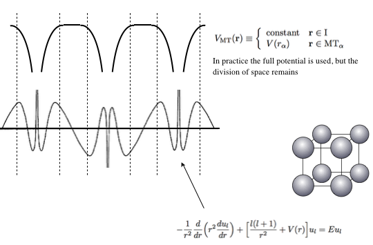

# day1-basics
Introduction to RSPt and bcc Fe

## Introduction 

#### Manual
the manual of RSPt is stored in the folder [documentation/manual](documentation/manual/).
To obtain the manual in pdf format one needs to type:
````
latex manual.tex
````
three times.

#### RSPt's basis set


#### RSPt simulation files 
To execute the `rspt` binary you need the following files:
- `data` (compound specific info, what atoms, basic functions, etc...)
- `spts` (information of the k-mesh)
- `atomdens` (information of the overlapping atomic density, which is used as a starting guess)
- `symcof` (Information about symmetries and basis)

An existing calculating also contains:
- `pot` (the potential)
- `eparm` (linearlization energies)

When setting up a calculation from scratch, one starts with *one* file called `symt.inp`.
It contains the basic information such as lattice vectors, lattice parameter and atom positions.
By typing: 
```bash
symt -all 
```
many of the files needed to run a simulation is created. Below follows a step-by-step description of how to setup a simulation of bcc Fe.

## bcc Fe
#### 1. Preparations
Before using RSPt, make sure the same modules are loaded as when compiling RSPt.
E.g. on Rackham, type:
```
module load intel/18.1 intelmpi/18.1
```
A convinient way is to load the module automatically at login by putting the command in the `~/.bashrc` file.

#### 2. Create simulation folder
To create a simulation from cratch one starts by creating and moving into a simulation folder, e.g.: 
```
mkdir Fe
cd Fe
``` 

#### 3. Create `symt.inp`
Create folder `sym` and move inside that folder: 
```
mkdir sym
cd sym
```
The `symt.inp` should contain basic information about the system. 
For a complete overview of possible input parameters in `symt.inp`, check out [documentation/manual](documentation/manual/).
In our case a functioning [`symt.inp`](symt.inp) already exists which we can copy to our `sym` folder.
The `symt.inp` works with free format, meaning keywords are used to categorize the information. 
The keywords in the provided `symt.inp`:
- `lengthscale` (lattice parameters)
- `latticevectors` (the latticevectors in column format)
- `spinpol` (to tell RSPt that the simulation should be spin polarized)
- `mtradii` (parameter to optimize Muffin-tin radius)
- `atoms` (first number of atoms in the unitcell followed by (position, atomic number, coordinate keyword, identity-tag) of each atom. The coordinate keyword tells if the atomic position is expressed in lattice-vectors (using `l`) or in cartesian coordinates (using `c`). The identity-tag can be used to distinguish between otherwise equivalent atoms. This tag can also be used to generate spin-polarized atomic densities, by either using tag `up` or tag `dn`.)
- `lmax` (how many spherical harmonics shall be used to express density and potential)

Once the `symt.inp` has the desired setup, type:
```
symt -all
```
Now many the folders `atom`, `bin`, `bz`, `dta` and some files should exist.

#### 4. Generate atomic density
Starting from the main diretory:
```
cd atom
make atom
```
This will generate an atomic density which will be used as a starting point for the DFT calculations.

#### 5. Generate k-mesh
Starting from the main diretory:
```
cd bz
cub
```
The user should now tell which symmetry-file to use when generating the k-mesh.
Almost always, use the default option (read ../symcof) by pressing the `enter` key.

Then specify desired k-mesh, e.g. `12 12 12`.

Input numerators for k-mesh shift vector, e.g. `0 0 0`.

Input deminonators for k-mesh shift vector, e.g. `1 1 1`.

Confirm the k-mesh by pressing the `enter` key.

Create tetrahedrons by pressing the `enter` key.

Finally type the `enter` key to quit the k-mesh generator. 

One has to actually select which k-mesh rspt should use, in case many were created in the `bz` directory.
To select the k-mesh generated by the commands above, type:
```
cd ..
link_spts 12_no
```
This generates symbolic links `spts`, `tetra` and `kmap` which point to the generated k-mesh in the `bz` directory.

#### 6. `dta` settings
The `dta` folder contains many settings for the basis set.
Before entering the folder copy two files:
```bash
cp dta/length_scale .
cp dta/strain_matrix .
```

#### 7. Generate the `data` file
Generate the final input file, called `data`, by typing:
```
make data
```

#### 8. Execute the `rspt` binary 
Run RSPt by executing the `rspt` binary:
```bash
mpirun -n 10 rspt 
```
This will run one DFT iteration and use 10 MPI ranks.
To perform several iterations either use a bash-loop:
```bash
for ((i=1;i<=20;i++));do
  mpirun -n 10 rspt
done
```
or use the `runs` binary:
```bash
runs 'mpirun -n 10 rspt' 1e-8 20
```
The latter will run 20 DFT iterators or stop if the converge parameter `fsq` becomes smaller than 1e-8.


#### 9. Analyze RSPt output


#### 10. Generate DOS 

